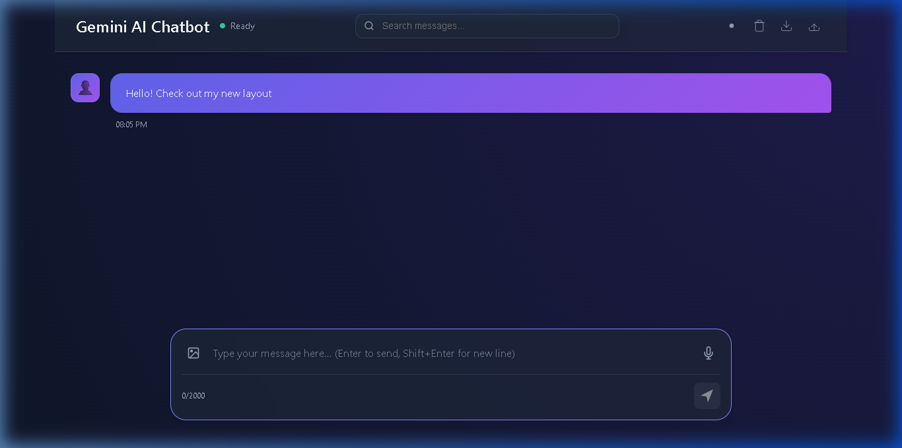

# Gemini AI Chatbot (Intermediate Level)


An advanced, full-stack AI chatbot powered by Google's Gemini Pro model. This version features a modular architecture, secure backend, streaming responses, and a **premium, glassmorphism-inspired UI**.



## ✨ Features

- 💎 **Premium Glassmorphism UI**: A stunning, modern design with translucent surfaces and fluid animations.
- 🎙️ **Voice Interaction**: Integrated Speech-to-Text (STT) and Text-to-Speech (TTS) capabilities.
- 🖼️ **Gemini Vision**: Multimodal support—upload and analyze images with the AI.
- 🔍 **Smart Search**: Instant chat history filtering and message search.
- 🚀 **Full-Stack Architecture**: Dedicated Node.js/Express backend for security and scalability.
- 🌊 **Streaming Responses**: Real-time AI response generation for a better user experience.
- 🌓 **Dark/Light Mode**: User-selectable themes with persistence.
- 🛡️ **Secure Backend**: API keys protected in environment variables, rate limiting, and security headers.
- 📱 **Responsive Design**: Optimized for both desktop and mobile devices.
- 💾 **Session Management**: Session-based chat history to manage context.
- 📤 **Export/Import Chat**: Save and reload your conversations easily.

## 🏗️ Project Structure

```text
gemini-ai-chatbot/
├── client/                     # Frontend
│   ├── src/
│   │   ├── js/                 # Modular JS (api.js, ui.js, app.js)
│   │   ├── css/                # Component-based CSS
│   │   └── assets/             # Static assets
│   └── index.html
├── server/                     # Backend
│   ├── src/
│   │   ├── routes/             # API Routes
│   │   ├── controllers/        # Request Handlers
│   │   ├── middleware/         # Security & Error Handling
│   │   └── services/           # External API Integrations
│   ├── server.js               # Entry Point
│   └── package.json
├── .env.example                # Environment Template
├── package.json                # Root automation scripts
└── README.md
```

## 🚀 Getting Started

### Prerequisites

- Node.js (v16+)
- Gemini API Key (Get it from [Google AI Studio](https://aistudio.google.com/))

### Installation

1. Clone the repository:
   ```bash
   git clone https://github.com/avy2025/Gemini-AI-Chatbot.git
   cd Gemini-AI-Chatbot
   ```

2. Install dependencies for both parts:
   ```bash
   npm run install-all
   npm install concurrently --save-dev
   ```

3. Setup environment variables:
   - Create a `.env` file in the `server/` directory.
   - Add your Gemini API key:
     ```env
     GEMINI_API_KEY=your_actual_api_key_here
     PORT=3000
     CLIENT_URL=http://localhost:8080
     ```

### Running Locally

To run both the frontend and backend simultaneously:

```bash
npm run dev
```

The frontend will be available at `http://localhost:8080` and the backend at `http://localhost:3000`.

## 🛠️ Built With

- **Frontend**: Vanilla HTML5, CSS3, JavaScript (ES6+ Modules)
- **Backend**: Node.js, Express.js
- **AI**: Google Generative AI (@google/generative-ai)
- **Security**: Helmet, CORS, Express Rate Limit

## 📝 License

This project is licensed under the MIT License - see the [LICENSE](LICENSE) file for details.

## 👤 Author

**avy2025**
- GitHub: [@avy2025](https://github.com/avy2025)

---
*Note: This project was upgraded to intermediate level to demonstrate production-ready patterns.*